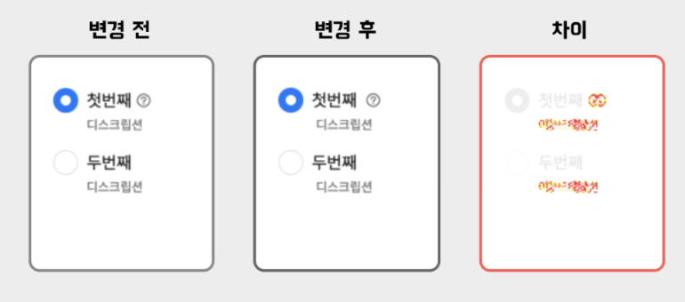
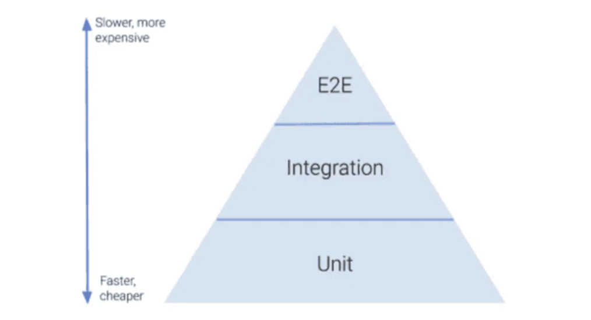
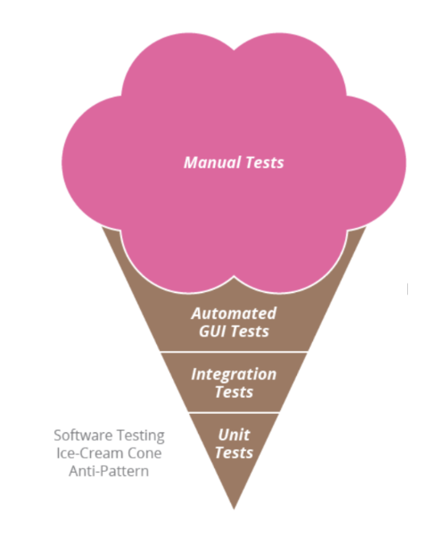
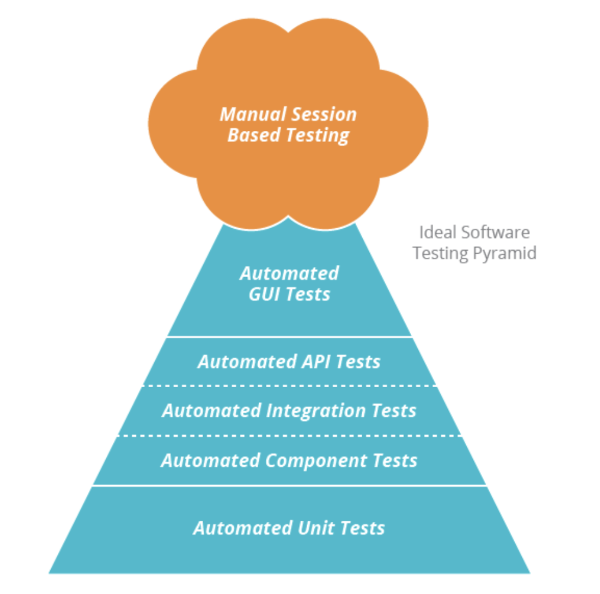

# Chapter 2 테스트 방법과 테스트 전략

## 테스트 범위와 목적

테스트 작성법부터 배우면 어떠한 상황에 어떠한 테스트가 맞는건지 판단하기 어렵다. 그러므로 먼저 프런트엔드 <b>테스트의 범위</b>와 <b>목적</b>을 이해해야 한다. `범위와 목적을 이해해야 테스트 자동화의 장점을 누릴 수 있다.`

### 2-1 테스트 범위

웹 애플리케이션을 구성하는 모듈

1. 라이브러리가 제공하는 함수
2. 로직을 담당하는 함수
3. UI 관련 함수
4. 웹 API 클라이언트
5. API 서버
6. 데이터베이스 서버

테스트를 작성할 때는 어디부터 어디까지 테스트에 포함해야할지 판단하는 것이 중요하다. 프런트엔드 개발 테스트 범위(또는 테스트 레벨)는 크게 네 가지로 분류한다.

#### 1. 정적 분석

타입스크립트, ESLint 등이 해주는 컴파일 이전 코드 정적 테스트이다. 하나의 모듈을 테스트하는데에도 쓰이지만 2~3, 3~4를 연계해서 사용할 때에도 사용한다. 정적 분석은 버그를 조기에 발견할 수 있으며, 타입 추론을 통해 런타임 동작을 예측할 수 있다.

```typescript
// 런타입 작동을 예측할 수 있게 해주는 타입 추론 예시
function getMessage(name: string | undefined) {
  const a = name;
  if (!name) {
    return 'Hello anonymous!';
  }
  // name이 undefined라는 분기문을 거쳐왔으니 이제 name은 자동으로 string으로 추론된다.
  const b = name; // b: string
  return `Hello ${name}`;
}
```

ESLint는 코드 가이드라인을 제공해준다. 부적절한 구문을 수정해서 잠재적으로 발생할 수 있는 버그를 수정한다.

```typescript
useEffect(() => {
  console.log(name);
}, []); // 의존성 배열에 참조 중인 name을 포함시켜야한다는 eslint 에러 발생
```

#### 2. 단위 테스트

한 가지 모듈에 한정하여 해당 모듈의 기능이 동작하는지 검증하는 테스트다. 독립된 환경에서 검증하므로 실제 애플리케이션을 사용할 때는 거의 발생하지 않는 케이스(`코너 케이스(corner case)`) 검증에 적합하다.

#### 3. 통합 테스트

1~4, 2~3 처럼 여러 모듈 조합으로 제공되는 기능을 검증하는 테스트다. 범위가 넓어질수록 효율적인 상대적으로 테스트가 가능하지만 대략적인 검증에 그치게 된다.

#### 4. E2E 테스트

1~4를 통틀어 헤드리스 브라우저와 UI 자동화 도구를 결합하여 검증하는 테스트다. UI 테스트뿐만 아니라 외부 스토리지, 데이터베이스 등 연동 중인 하위 시스템도 포함이 된다. 가장 광범위한 통합 테스트이며, 실제 애플리케이션을 사용할 때와 가장 유사한 테스트이다.

### 2-2 테스트 목적

#### 1. 기능 테스트 (인터렉션 테스트)

기능 테스트는 클라이언트가 제공한 기능명세를 이용하여 수행하며 소프트웨어의 기능 요구사항을 확인하는 테스트이다.
프런트엔드의 주요 개발 대상은 사용자가 조작하는 UI 컴포넌트다. 그러므로 프런트엔드의 기능 테스트는 인터랙션 테스트가 대부분이다.

#### 2. 비기능 테스트 (접근성 테스트)

소프트웨어 시스템의 성능, 안정성, 확장성 등 비기능적 측면을 확인한다.
'키보드만으로 웹사이트를 이용할 수 있는가', '명암비가 시인성에 문제는 없는가'와 같은 사용자의 접근성 테스트를 비기능 테스트라고 한다.

- 접근성 테스트 실제 사례

1. 체크 박스를 체크할 수 있다.
2. 오류 응답을 받았을 때 오류 문구를 렌더링한다.
3. 랜덩링된 화면에 접근성 위반 사례가 있는지 검사한다.

#### 3. 시각적 회귀 테스트

시각적 회귀테스트는 변경 전/후의 스크린샷을 비교해 차이를 감지하고 예기치 못한 오류를 확인하여 UI의 시각적 일관성을 제공할 수 있도록 하는 테스트이다.



랜더링된 상태만 캡처하여 비교하는 것뿐만 아니라 사용자 조작으로 변경된 화면까지 캡처하여 비교해야한다.

<br><br><br><br>

## 테스트 전략 모델

테스트 방법을 아래의 사진처럼 몇 가지 계층으로 분류할 수 있다.
삼각형의 위로 갈수록 실제 제품과 유사한 테스트가 가능하지만 비용이 많이 투입되며 변경 사항으로 인해 낮은 안정성을 갖고 있다.
삼각형의 아래로 갈수록 비용이 적고 높은 안정성을 갖고있지만 실제 제품과의 유사성과는 거리가 멀다.
그래서 무엇을 테스트하는 것인가에 따라 각 테스트 단계에 사용하는 비중을 고르게 나눠야한다.



#### 1. 아이스크림 콘

상층부 테스트의 비중이 높은 아이스크림 콘은 안티패턴으로 유명하다. 운용 비용이 높을 뿐만 아니라 외부 모듈의 의존성 때문에 불안정하다.



#### 2. 테스트 피라미드

하층부의 비율이 큰 테스트 모델이다.
하층부 테스트의 비중이 높을수록 더욱 안정적이고 가성비 높은 테스트가 가능하다는 것이 특징이다.



#### 3. 테스팅 트로피

통합 테스트 비중이 가장 높은 테스팅 트로피 모델이다. 사용자 조작을 기점으로 한 통합 테스트 비중이 높을수록 더욱 우수한 테스트 전략이라는 의도가 있다.

<br><br><br><br>

## 테스트 전략 계획

#### 1. 테스트가 없어 리팩터링이 불안한 경우

릴리스된 기능을 목록에 정리한 후 변경 전후로 결함이 발생하지 않았는지 검증하는 회귀 테스트를 작성한다. 작성된 회귀 테스트가 있으면
리팩터링이 한 층 수월해진다.

#### 2. 반응형으로 제작된 프로젝트

반응형처럼 디바이스 간 서로 다른 스타일을 제공하는 경우, CSS가 적용된 렌더링 결과를 검증할 브라우저 시각적 회귀 테스트가 필요하다.
이 때 사용하는 스토리북을 사용하여 UI 컴포넌트 단위로 테스트가 가능하다.

#### 3. 데이터베이스를 포함한 E2E 테스트가 필요한 겨웅

테스트용 스테이징 환경을 사용해야 한다. E2E 테스트는 테스트 엔지니어가 프로젝트를 릴리스하기 전에 테스트 계획서를 보면서 수동으로 하는 경우도 있고, 브라우저를 사용한 UI 자동화 방식으로 테스트하는 경우도 있다.
