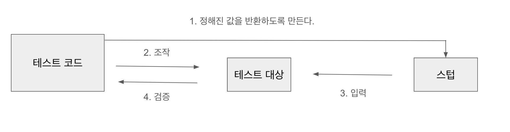
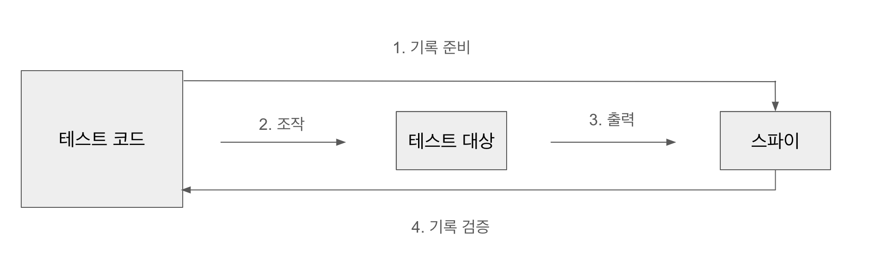

# Chapter 4 목 객체

## 1. 목 객체를 사용하는 이유

실제 객체를 흉내 내는 가짜 객체를 만들어냄으로써, 테스트 환경에서 실제 객체의 동작을 모방하여 테스트의 독립성을 보장하며 실제 환경과 유사하게 만들어 낸다.

<br/>

## 2. 목 객체 용어

### 2 - 1 스텁(stub)

스텁은 주로 대역으로 사용한다.

- 의존 중인 컴포넌트의 대역
- 정해진 값을 반환하는 용도
- 테스트 대상에 할당하는 입력값

스텁은 정해진 값을 반환하는 객체다. 대체로 이런 값을 반환받았을 때 이렇게 작동해야 하는 경우에 사용한다.



### 2 - 2 스파이(spy)

스파이는 주로 기록하는 용도로 사용한다.

- 함수나 메서드의 호출 기록
- 호출된 횟수나 실행 시 사용한 이수 기록
- 테스트 대상의 출력 확인

스파이는 테스트 대상 외부의 출력을 검증할 때 사용한다. 대체로 인수로 받은 콜백 함수를 검증할 때 사용한다.
콜백 함수가 시행된 횟수, 실행 시 사용한 인수 등을 기록을 하여 콜백을 검증할 수 있다.



## 3. 목 모듈을 활용한 스텁

### 테스트할 함수

```typescript
export function greet(name: string) {
  return `Hello! ${name}.`;
}

export function sayGoodBye(name: string) {
  throw new Error('미구현');
}
```

`jest.mock` 을 사용하면 모듈을 실제 모듈에서 테스트 모듈로 대체할 수 있다.

```typescript
import { greet } from './greet';

jest.mock('./greet');

test('인사말을 반환하지 않는다(원래 구현과 다르게)', () => {
  // 테스트 통과 ✅
  expect(greet('Taro')).toBe(undefined); // jest.mock을 사용해서 greet 함수가 테스트 모듈로 대체되었으니 undefined를 반환한다.
});
```

`jest.mock` 두 번째 인수에는 대체할 함수를 구현할 수 있다.

```typescript
import { greet, sayGoodBye } from './greet';

jest.mock('./greet', () => ({
  sayGoodBye: (name: string) => `Good bye, ${name}.`,
}));

test('인사말이 구현되어 있지 않다(원래 구현과 다르게)', () => {
  // 테스트 통과 ✅
  expect(greet).toBe(undefined);
});

test('작별 인사를 반환한다(원래 구현과 다르게)', () => {
  // 테스트 통과 ✅
  const message = `${sayGoodBye('Taro')} See you.`;
  expect(message).toBe('Good bye, Taro. See you.');
});
```

모듈 일부만 스텁으로 대체하고 싶다면 `jest.requireActual` 을 사용한다.

```typescript
import { greet, sayGoodBye } from './greet';

jest.mock('./greet', () => ({
  ...jest.requireActual('./greet'),
  sayGoodBye: (name: string) => `Good bye, ${name}.`,
}));

// 테스트 통과 ✅
test('인사말을 반환한다(원래 구현대로)', () => {
  expect(greet('Taro')).toBe('Hello! Taro.');
});

// 테스트 통과 ✅
test('작별 인사를 반환한다(원래 구현과 다르게)', () => {
  const message = `${sayGoodBye('Taro')} See you.`;
  expect(message).toBe('Good bye, Taro. See you.');
});
```

## 4. 스텁 실전

테스트할 함수

```typescript
export type Profile = {
  id: string;
  name?: string;
  age?: number;
  email: string;
};

export function getMyProfile(): Promise<Profile> {
  // 웹 API 요청
  return fetch('https://myapi.testing.com/my/profile').then(async (res) => {
    const data = await res.json();
    if (!res.ok) {
      throw data;
    }
    return data;
  });
}

// getMyProfile 로 취득한 데이터는 가공된 뒤 렌더링된다.

export async function getGreet() {
  const data = await getMyProfile();
  if (!data.name) {
    // 1. name이 없으면 하드코딩된 인사말을 반환한다.
    return `Hello, anonymous user!`;
  }
  // 2. name이 있으면 name을 포함한 인사말을 반환한다.
  return `Hello, ${data.name}!`;
}
```

테스트 코드

```typescript
describe('getGreet', () => {
  // 테스트 통과 ✅
  test('데이터 취득 성공 시 : 사용자 이름이 없는 경우', async () => {
    // getMyProfile이 resolve됐을 때의 값을 재현
    jest.spyOn(Fetchers, 'getMyProfile').mockResolvedValueOnce({
      // mockResolvedValueOnce는 함수의 프로미스 반환값을 정해줄 수 있다. 일종의 스텁 개념이다.
      id: 'xxxxxxx-123456',
      email: 'taroyamada@myapi.testing.com',
    });
    await expect(getGreet()).resolves.toBe('Hello, anonymous user!'); //
  });

  // 테스트 통과 ✅
  test('데이터 취득 성공 시: 사용자 이름이 있는 경우', async () => {
    jest.spyOn(Fetchers, 'getMyProfile').mockResolvedValueOnce({
      id: 'xxxxxxx-123456',
      email: 'taroysamada@myapi.testing.com',
      name: 'taroyamada',
    });
    await expect(getGreet()).resolves.toBe('Hello, taroyamada!');
  });

  // 테스트 통과 ✅
  test('데이터 취득 실패 시', async () => {
    // getMyProfile이 reject됐을 때의 값을 재현
    jest.spyOn(Fetchers, 'getMyProfile').mockRejectedValueOnce(httpError); // reject값도 스텁으로 만들 수 있다.
    await expect(getGreet()).rejects.toMatchObject({
      err: { message: 'internal server error' },
    });
  });

  // 테스트 통과 ✅
  test('데이터 취득 실패 시 에러가 발생한 데이터와 함께 예외가 throw된다', async () => {
    expect.assertions(1); // try-catch문을 사용했으니 이것을 잊지말자!
    jest.spyOn(Fetchers, 'getMyProfile').mockRejectedValueOnce(httpError);
    try {
      await getGreet();
    } catch (err) {
      expect(err).toMatchObject(httpError);
    }
  });
});
```

## 5. 웹 API 목 객체 생성 함수가

테스트할 함수

```typescript
export async function getMyArticleLinksByCategory(category: string) {
  // 데이터 취득 함수(Web API 클라이언트)
  const data = await getMyArticles();
  // 취득한 데이터 중 지정한 태그를 포함한 기사만 골라낸다.
  const articles = data.articles.filter((article) =>
    article.tags.includes(category)
  );
  if (!articles.length) {
    // 해당되는 기사가 없으면 null을 반환한다.
    return null;
  }
  // 해당되는 기사가 있으면 목록용으로 가공해서 데이터를 반환한다.
  return articles.map((article) => ({
    title: article.title,
    link: `/articles/${article.id}`,
  }));
}

export type Article = {
  id: string;
  createdAt: string;
  tags: string[];
  title: string;
  body: string;
};

export type Articles = {
  articles: Article[];
};
```

`getMyArticleLinksByCategory`의 테스트 케이스

- 지정한 태그를 가진 기사가 한 건도 없으면 `null`을 반환
- 지정한 태그를 가진 기사가 한 건 이상 있으면 링크 목록을 반환
- 데이터 취득에 실패하면 예외 발생

```typescript
function mockGetMyArticles(status = 200) {
  if (status > 299) {
    return jest
      .spyOn(Fetchers, 'getMyArticles')
      .mockRejectedValueOnce(httpError);
  }
  return jest
    .spyOn(Fetchers, 'getMyArticles')
    .mockResolvedValueOnce(getMyArticlesData);
}

// 테스트 통과 ✅
test('지정한 태그를 포함한 기사가 한 건도 없으면 null을 반환한다', async () => {
  mockGetMyArticles();
  const data = await getMyArticleLinksByCategory('playwright');
  expect(data).toBeNull();
});

// 테스트 통과 ✅
test('지정한 태그를 포함한 기사가 한 건 이상 있으면 링크 목록을 반환한다', async () => {
  mockGetMyArticles();
  const data = await getMyArticleLinksByCategory('testing');
  expect(data).toMatchObject([
    {
      link: '/articles/howto-testing-with-typescript',
      title: '타입스크립트를 사용한 테스트 작성법',
    },
    {
      link: '/articles/react-component-testing-with-jest',
      title: '제스트로 시작하는 리액트 컴포넌트 테스트',
    },
  ]);
});

// 테스트 통과 ✅
test('데이터 취득에 실패하면 reject된다', async () => {
  mockGetMyArticles(500);
  await getMyArticleLinksByCategory('testing').catch((err) => {
    expect(err).toMatchObject({
      err: { message: 'internal server error' },
    });
  });
});
```

## 6 목 함수를 사용하는 스파이

- 실행되었는지 검증하기

```typescript
// 테스트 통과 ✅
test('목 함수가 실행됐다', () => {
  const mockFn = jest.fn();
  mockFn();
  expect(mockFn).toBeCalled();
});

// 테스트 통과 ✅
test('목 함수가 실행되지 않았다', () => {
  const mockFn = jest.fn();
  expect(mockFn).not.toBeCalled();
});
```

- 실행 횟수 검증

```typescript
// 테스트 통과 ✅
test('목 함수는 실행 횟수를 기록한다', () => {
  const mockFn = jest.fn();
  mockFn();
  expect(mockFn).toHaveBeenCalledTimes(1);
  mockFn();
  expect(mockFn).toHaveBeenCalledTimes(2);
});
```

- 실행 시 인수 검증

```typescript
// 테스트 통과 ✅
const mockFn = jest.fn();
function greet(message: string) {
  mockFn(message); // 인수를 받아 실행된다.
}
greet('hello'); // "hello"를 인수로 실행된 것이 mockFn에 기록된다.
expect(mockFn).toHaveBeenCalledWith('hello');
```

- 인수가 객체일 때의 검증

`toHaveBeenCalledWith`을 이용하면 된다.
객체 전체가 아닌 일부 프로퍼티만 검증하고 싶다면 `objectContaining`를 이용한다.

```typescript
// 테스트 통과 ✅
test('목 함수는 실행 시 인수가 객체일 때에도 검증할 수 있다', () => {
  const mockFn = jest.fn();
  checkConfig(mockFn);
  expect(mockFn).toHaveBeenCalledWith({
    mock: true,
    feature: { spy: true },
  });
});

// 테스트 통과 ✅
test('expect.objectContaining를 사용한 부분 검증', () => {
  const mockFn = jest.fn();
  checkConfig(mockFn);
  expect(mockFn).toHaveBeenCalledWith(
    expect.objectContaining({
      feature: { spy: true },
    })
  );
});
```
