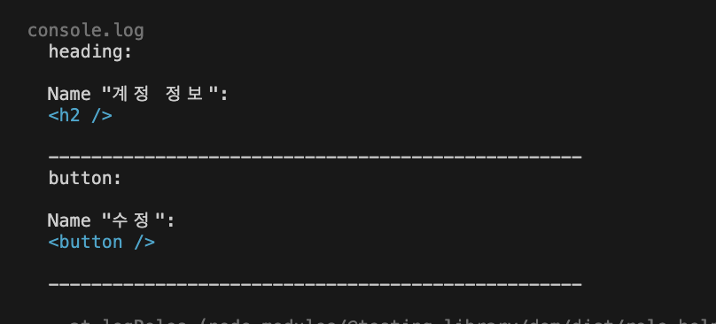

# Chapter 5 UI 컴포넌트 테스트

## 1. UI 컴포넌트 테스트 개념

### 1 - 1 UI 컴포넌트 테스트

```
최소 단위의 UI -> 중간 크기의 UI -> 화면 단위의 UI -> 애플리케이션으로 조합된 UI
```

UI 컴포넌트의 최소 단위는 버튼과 같은 개별 UI다. 작은 UI 컴포넌틑를 조합하여 중간 크기의 컴포넌트를 만들고,
작은 단위부터 하나씩 조합해 화면 단위의 UI를 완성한다. 그리고 화면 단위의 UI가 모여 비로소 애플리케이션이 완성된다.<br/>
만약 여기서 중간 크기의 UI 컴포넌트에 문제가 생기게 된다면, 크리티컬한 경우 애플리케이션을 사용하지 못하게 될 수도 있다.
그러므로 UI 컴포넌트 테스트를 작성해야 하는 이유다.

### 1 - 2 웹 접근성 테스트

신체적, 정신적 특성에 따른 차이 없이 정보에 접근할 수 있는 정도를 웹 정근성이라고 한다. 웹 접근성은 화면에 보이는 문제가 아니기 때문에
의식적으로 신경 써야만 알 수 있다. 디자인대로 화면이 구현됐고, 마우스 입력에 따라 정상적으로 작동한다면 품질에 문제가 없다고 생각하기 때문이다.
개발자는 반드시 모든 사용자가 사용할 수 있다는 것을 염두해 두어야한다.

이런 웹 접근성을 향상시키기에는 UI 컴포넌트 테스트를 활용하는 것이 좋다. 왜냐하면 모든 사용자를 동일하게 요소들을 인식할 수 있는 쿼리로
테스트를 작성해야 하기 때문이다.

<br/>

## 2. UI 테스팅 라이브러리

리액트 UI 테스팅 라이브러리에 쓰이는 기본적으로 4가지가 있다.

1. jest-environment-jsdom : jest는 기본적으로 node.js 환경에서 실행되기 때문에 dom API가 존재하지 않는다. 이 문제를 해결하려면 설치해야되는 모듈
2. testing-library/react : 리액트 컴포넌트 테스팅 라이브러리
3. testing-library/jest-dom : UI 컴포넌틑 테스트용 매처 확장
4. testing-library/user-event : 실제 사용자의 입력에 가깝게 시뮬레이션이 가능한 테스팅 라이브러리

❗️ fireEvent API는 dom 이벤트를 발생시킬 뿐이다. 실제 사용자의 불가능한 입력 패턴을 만들기는 어렵다.

<br/>

## 3. UI 테스트

### Form UI 컴포넌트 테스트

테스트할 Form 컴포넌트

```typescript
type Props = {
  name: string;
  onSubmit?: (event: React.FormEvent<HTMLFormElement>) => void;
};
export const Form = ({ name, onSubmit }: Props) => {
  return (
    <form
      onSubmit={(event) => {
        event.preventDefault();
        onSubmit?.(event);
      }}
    >
      <h2>계정 정보</h2>
      <p>{name}</p>
      <div>
        <button>수정</button>
      </div>
    </form>
  );
};
```

테스트 코드

```typescript
// 테스트 통과 ✅
test('이름을 표시한다', () => {
  render(<Form name='taro' />);
  expect(screen.getByText('taro')).toBeInTheDocument();
});

// 테스트 통과 ✅
test('버튼을 표시한다', () => {
  render(<Form name='taro' />);
  expect(screen.getByRole('button')).toBeInTheDocument();
});

// 테스트 통과 ✅
test('heading을 표시한다', () => {
  render(<Form name='taro' />);
  expect(screen.getByRole('heading')).toHaveTextContent('계정 정보');
});

// 목 함수를 Form에 전달해 button이 클릭되었는지 테스트한다
// 테스트 통과 ✅
test('버튼을 클릭하면 이벤트 핸들러가 실행된다', () => {
  const mockFn = jest.fn();
  render(<Form name='taro' onSubmit={mockFn} />);
  fireEvent.click(screen.getByRole('button'));
  expect(mockFn).toHaveBeenCalled();
});
```

<br/>

### Item List UI 컴포넌트 테스트

테스트할 코드

```typescript
import { ArticleListItem, ItemProps } from './ArticleListItem';

type Props = {
  items: ItemProps[];
};

export const ArticleList = ({ items }: Props) => {
  return (
    <div>
      <h2>기사 목록</h2>
      {items.length ? (
        <ul>
          {items.map((item) => (
            <ArticleListItem {...item} key={item.id} />
          ))}
        </ul>
      ) : (
        <p>게재된 기사가 없습니다</p>
      )}
    </div>
  );
};
```

테스트용 데이터

```typescript
export const items: ItemProps[] = [
  {
    id: 'howto-testing-with-typescript',
    title: '타입스크립트를 사용한 테스트 작성법',
    body: '테스트 작성 시 타입스크립트를 사용하면 테스트의 유지 보수가 쉬워진다',
  },
  {
    id: 'nextjs-link-component',
    title: 'Next.js의 링크 컴포넌트',
    body: 'Next.js는 화면을 이동할 때 링크 컴포넌트를 사용한다',
  },
  {
    id: 'react-component-testing-with-jest',
    title: '제스트로 시작하는 리액트 컴포넌트 테스트',
    body: '제스트는 단위 테스트처럼 UI 컴포넌트를 테스트할 수 있다',
  },
];
```

<br/>

테스트 코드(리스트)

```typescript
// 테스트 통과 ✅
test('제목을 표시한다', () => {
  render(<ArticleList items={items} />);
  expect(
    screen.getByRole('heading', { name: '기사 목록' })
  ).toBeInTheDocument();
});

// 테스트 통과 ✅
test('items의 수만큼 목록을 표시한다', () => {
  render(<ArticleList items={items} />);
  expect(screen.getAllByRole('listitem')).toHaveLength(3);
});

// 테스트 통과 ✅
// within으로 범위를 좁혀서 테스트한다.
test('items의 수만큼 목록을 표시한다', () => {
  render(<ArticleList items={items} />);
  const list = screen.getByRole('list');
  expect(list).toBeInTheDocument();
  expect(within(list).getAllByRole('listitem')).toHaveLength(3);
});

// 테스트 통과 ✅
test("목록에 표시할 데이터가 없으면 '게재된 기사가 없습니다'를 표시한다", () => {
  // 빈 배열을 items에 할당하여 목록에 표시할 데이터가 없는 상황을 재현한다.
  render(<ArticleList items={[]} />);
  // 존재하지 않을 것으로 예상하는 요소의 취득을 시도한다.
  const list = screen.queryByRole('list');
  // list가 존재하지 않는다.
  expect(list).not.toBeInTheDocument();
  // list가 null이다.
  expect(list).toBeNull();
  // '게재된 기사가 없습니다'가 표시됐는지 확인한다.
  expect(screen.getByText('게재된 기사가 없습니다')).toBeInTheDocument();
});
```

<br/>

테스트할 코드(개별 아이템)

```typescript
export type ItemProps = {
  id: string;
  title: string;
  body: string;
};

export const ArticleListItem = ({ id, title, body }: ItemProps) => {
  return (
    <li>
      <h3>{title}</h3>
      <p>{body}</p>
      <a href={`/articles/${id}`}>더 알아보기</a>
    </li>
  );
};
```

```typescript
const item: ItemProps = {
  id: 'howto-testing-with-typescript',
  title: '타입스크립트를 사용한 테스트 작성법',
  body: '테스트 작성 시 타입스크립트를 사용하면 테스트의 유지 보수가 쉬워진다',
};

// 테스트 통과 ✅
test('링크에 id로 만든 URL을 표시한다', () => {
  render(<ArticleListItem {...item} />);
  expect(screen.getByRole('link', { name: '더 알아보기' })).toHaveAttribute(
    'href',
    '/articles/howto-testing-with-typescript'
  );
});
```

<br/>

## 4. 인터랙티브 UI 테스트

### 이용 약관 동의 UI 컴포넌트 테스트

테스트할 코드

```typescript
type Props = {
  onChange?: React.ChangeEventHandler<HTMLInputElement>;
};

export const Agreement = ({ onChange }: Props) => {
  return (
    <fieldset>
      <legend>이용 약관 동의</legend>
      <label>
        <input type='checkbox' onChange={onChange} />
        서비스&nbsp;<a href='/terms'>이용 약관</a>을 확인했으며 이에 동의합니다
      </label>
    </fieldset>
  );
};
```

테스트 코드

```typescript
// 테스트 통과 ✅
test('fieldset의 접근 가능한 이름을 legend에서 인용합니다', () => {
  render(<Agreement />);
  expect(
    screen.getByRole('group', { name: '이용 약관 동의' })
  ).toBeInTheDocument();
});

// 테스트 통과 ✅
test('체크 박스가 체크되어 있지 않습니다', () => {
  render(<Agreement />);
  expect(screen.getByRole('checkbox')).not.toBeChecked();
});
```

### 계정 정보 입력 UI 컴포넌트 테스트

테스트할 코드

```typescript
export const InputAccount = () => {
  return (
    <fieldset>
      <legend>계정정보 입력</legend>
      <div>
        <label>
          메일주소
          <input type='text' placeholder='example@test.com' />
        </label>
      </div>
      <div>
        <label>
          비밀번호
          <input type='password' placeholder='8자 이상' />
        </label>
      </div>
    </fieldset>
  );
};
```

테스트 코드

`<input type='password'/>` 는 `screen.getByRole('textbox')`로 찾아올 수 없다.
그래서 이 예제에서는 `screen.getByPlaceholderText('8자 이상'))`로 찾았다.

```typescript
// 테스트 통과 ✅
test('fieldset의 접근 가능한 이름을 legend에서 인용합니다', () => {
  render(<InputAccount />);
  expect(
    screen.getByRole('group', { name: '계정정보 입력' })
  ).toBeInTheDocument();
});

// 테스트 통과 ✅
test('메일주소 입력란', async () => {
  render(<InputAccount />);
  // 메일주소 입력란 취득
  const textbox = screen.getByRole('textbox', { name: '메일주소' });
  const value = 'taro.tanaka@example.com';
  // textbox에 value를 입력
  await user.type(textbox, value); // 유저가 타이핑할 때까지 기다려야 하니 await를 사용한다
  // 초깃값이 입력된 폼 요소가 존재하는지 검증
  expect(screen.getByDisplayValue(value)).toBeInTheDocument();
});

// 테스트 실패 ⛔️
test('비밀번호 입력란', async () => {
  render(<InputAccount />);
  expect(() => screen.getByRole('textbox', { name: '비밀번호' })).not.toThrow();
});

// 테스트 통과 ✅
test('비밀번호 입력란', async () => {
  render(<InputAccount />);
  expect(() => screen.getByPlaceholderText('8자 이상')).not.toThrow();
  expect(() => screen.getByRole('textbox', { name: '비밀번호' })).toThrow();
});

// 테스트 통과 ✅
test('비밀번호 입력란', async () => {
  render(<InputAccount />);
  const password = screen.getByPlaceholderText('8자 이상');
  const value = 'abcd1234';
  await user.type(password, value);
  expect(screen.getByDisplayValue(value)).toBeInTheDocument();
});
```

### 신규 회원가입 폼 UI 컴포넌트 테스트

테스트할 코드

```typescript
export const Form = () => {
  const [checked, setChecked] = useState(false);
  const headingId = useId(); // react 18 에 추가된 hooks HTML에 안에 접근성이 필요한 id를 고유하게 만들어준다
  return (
    <form aria-labelledby={headingId}>
      <h2 id={headingId}>신규 계정 등록</h2>
      <InputAccount />
      <Agreement
        onChange={(event) => {
          setChecked(event.currentTarget.checked);
        }}
      />
      <div>
        <button disabled={!checked}>회원가입</button>
      </div>
    </form>
  );
};
```

테스트 코드

```typescript
test('form의 접근 가능한 이름은 heading에서 인용합니다', () => {
  render(<Form />);
  expect(
    screen.getByRole('form', { name: '신규 계정 등록' })
  ).toBeInTheDocument();
});

test('주요 영역이 표시되어 있다', () => {
  render(<Form />);
  expect(
    screen.getByRole('heading', { name: '신규 계정 등록' })
  ).toBeInTheDocument();
  expect(
    screen.getByRole('group', { name: '계정정보 입력' })
  ).toBeInTheDocument();
  expect(
    screen.getByRole('group', { name: '이용 약관 동의' })
  ).toBeInTheDocument();
  expect(screen.getByRole('button', { name: '회원가입' })).toBeInTheDocument();
});

test('회원가입 버튼은 비활성화 상태다', () => {
  render(<Form />);
  expect(screen.getByRole('button', { name: '회원가입' })).toBeDisabled();
});

test('이용 약관에 동의하는 체크 박스를 클릭하면 회원가입 버튼은 활성화된다', async () => {
  render(<Form />);
  await user.click(screen.getByRole('checkbox'));
  expect(screen.getByRole('button', { name: '회원가입' })).toBeEnabled();
});
```

</br>

## 5. 유틸리티 함수를 활용한 테스트

### 배송지 정보 입력 UI 컴포넌트 테스트

#### 분기점

- 이전 배송지가 없음
- 이전 배송지가 있음: 새로운 배송지를 등록하지 않는다.
- 이전 배송지가 있음: 새로운 배송지를 등록한다.

테스트할 코드

```typescript
export type AddressOption = React.ComponentProps<'option'> & { id: string };
export type Props = {
  deliveryAddresses?: AddressOption[];
  onSubmit?: (event: React.FormEvent<HTMLFormElement>) => void;
};
export const Form = (props: Props) => {
  const [registerNew, setRegisterNew] = useState<boolean | undefined>(
    undefined
  );
  return (
    <form onSubmit={props.onSubmit}>
      <h2>배송지 정보 입력</h2>
      <ContactNumber />
      {props.deliveryAddresses?.length ? (
        <>
          <RegisterDeliveryAddress onChange={setRegisterNew} />
          {registerNew ? (
            <DeliveryAddress title='새로운 배송지' />
          ) : (
            <PastDeliveryAddress
              disabled={registerNew === undefined}
              options={props.deliveryAddresses}
            />
          )}
        </>
      ) : (
        <DeliveryAddress />
      )}
      <hr />
      <div>
        <button>주문내용 확인</button>
      </div>
    </form>
  );
};
```

#### 폼 입력을 함수화하기

```typescript
// 전화번호와 이름을 입력하는 함수
async function inputContactNumber(
  inputValues = {
    name: '배언수',
    phoneNumber: '000-0000-0000',
  }
) {
  await user.type(
    screen.getByRole('textbox', { name: '전화번호' }),
    inputValues.phoneNumber
  );
  await user.type(
    screen.getByRole('textbox', { name: '이름' }),
    inputValues.name
  );
  return inputValues;
}

// 배송지를 입력하는 함수
async function inputDeliveryAddress(
  inputValues = {
    postalCode: '16397',
    prefectures: '경기도',
    municipalities: '수원시 권선구',
    streetNumber: '매곡로 67',
  }
) {
  await user.type(
    screen.getByRole('textbox', { name: '우편번호' }),
    inputValues.postalCode
  );
  await user.type(
    screen.getByRole('textbox', { name: '시/도' }),
    inputValues.prefectures
  );
  await user.type(
    screen.getByRole('textbox', { name: '시/군/구' }),
    inputValues.municipalities
  );
  await user.type(
    screen.getByRole('textbox', { name: '도로명' }),
    inputValues.streetNumber
  );
  return inputValues;
}
// 목 생성 함수
async function clickSubmit() {
  await user.click(screen.getByRole('button', { name: '주문내용 확인' }));
}

function mockHandleSubmit() {
  const mockFn = jest.fn();
  const onSubmit = (event: React.FormEvent<HTMLFormElement>) => {
    event.preventDefault();
    const formData = new FormData(event.currentTarget);
    const data: { [k: string]: unknown } = {};
    formData.forEach((value, key) => (data[key] = value));
    mockFn(data);
  };
  return [mockFn, onSubmit] as const;
}
```

#### 이전 배송지가 없는 경우의 테스트

```typescript
describe('이전 배송지가 없는 경우', () => {
  // 테스트 통과 ✅
  test('배송지 입력란이 존재한다', () => {
    render(<Form />);
    expect(screen.getByRole('group', { name: '연락처' })).toBeInTheDocument();
    expect(screen.getByRole('group', { name: '배송지' })).toBeInTheDocument();
  });

  // 테스트 통과 ✅
  test('폼을 제출하면 입력 내용을 전달받는다', async () => {
    const [mockFn, onSubmit] = mockHandleSubmit();
    render(<Form onSubmit={onSubmit} />);
    const contactNumber = await inputContactNumber();
    const deliveryAddress = await inputDeliveryAddress();
    await clickSubmit();
    expect(mockFn).toHaveBeenCalledWith(
      expect.objectContaining({ ...contactNumber, ...deliveryAddress })
    );
  });
});
```

#### 이전 배송지가 있는 경우의 테스트

```typescript
describe('이전 배송지가 있는 경우', () => {
  // 테스트 통과 ✅
  test('질문에 대답할 때까지 배송지를 선택할 수 없다', () => {
    render(<Form deliveryAddresses={deliveryAddresses} />);
    expect(
      screen.getByRole('group', { name: '새로운 배송지를 등록하시겠습니까?' })
    ).toBeInTheDocument();
    expect(screen.getByRole('group', { name: '이전 배송지' })).toBeDisabled();
  });

  // 테스트 통과 ✅
  test("'아니오'를 선택하고 제출하면 입력 내용을 전달받는다", async () => {
    const [mockFn, onSubmit] = mockHandleSubmit();
    render(<Form deliveryAddresses={deliveryAddresses} onSubmit={onSubmit} />);
    await user.click(screen.getByLabelText('아니오'));
    expect(
      screen.getByRole('group', { name: '이전 배송지' })
    ).toBeInTheDocument();
    const inputValues = await inputContactNumber();
    await clickSubmit();
    expect(mockFn).toHaveBeenCalledWith(expect.objectContaining(inputValues));
  });

  // 테스트 통과 ✅
  test("'네'를 선택하고 제출하면 입력 내용을 전달받는다", async () => {
    const [mockFn, onSubmit] = mockHandleSubmit();
    render(<Form deliveryAddresses={deliveryAddresses} onSubmit={onSubmit} />);
    await user.click(screen.getByLabelText('네'));
    expect(
      screen.getByRole('group', { name: '새로운 배송지' })
    ).toBeInTheDocument();
    const contactNumber = await inputContactNumber();
    const deliveryAddress = await inputDeliveryAddress();
    await clickSubmit();
    expect(mockFn).toHaveBeenCalledWith(
      expect.objectContaining({ ...contactNumber, ...deliveryAddress })
    );
  });

```

## 6. 비동기 처리가 포함된 UI 컴포넌트 테스트

### 계정 정보 UI 컴포넌트 테스트

테스트할 코드

```typescript
export const RegisterAddress = () => {
  const [postResult, setPostResult] = useState('');
  return (
    <div>
      <Form
        onSubmit={handleSubmit((values) => {
          try {
            checkPhoneNumber(values.phoneNumber);
            postMyAddress(values)
              .then(() => {
                setPostResult('등록됐습니다');
              })
              .catch(() => {
                setPostResult('등록에 실패했습니다');
              });
          } catch (err) {
            if (err instanceof ValidationError) {
              setPostResult('올바르지 않은 값이 포함되어 있습니다');
              return;
            }
            setPostResult('알 수 없는 에러가 발생했습니다');
          }
        })}
      />
      {postResult && <p>{postResult}</p>}
    </div>
  );
};
```

```typescript
const headers = {
  Accept: 'application/json',
  'Content-Type': 'application/json',
};

export function postMyAddress(values: unknown): Promise<Result> {
  return fetch(host('/my/address'), {
    method: 'POST',
    body: JSON.stringify(values),
    headers,
  }).then(handleResponse);
}

// 목 함수
export function mockPostMyAddress(status = 200) {
  if (status > 299) {
    return jest
      .spyOn(Fetchers, 'postMyAddress')
      .mockRejectedValueOnce(httpError);
  }
  return jest
    .spyOn(Fetchers, 'postMyAddress')
    .mockResolvedValueOnce(postMyAddressMock);
}

// 입력된 값을 전송하는 인터랙션 함수
async function fillValuesAndSubmit() {
  const contactNumber = await inputContactNumber();
  const deliveryAddress = await inputDeliveryAddress();
  const submitValues = { ...contactNumber, ...deliveryAddress };
  await clickSubmit();
  return submitValues;
}
```

<br/>

테스트 코드

```typescript
// 테스트 통과 ✅
test("성공하면 '등록됐습니다'가 표시된다", async () => {
  const mockFn = mockPostMyAddress();
  render(<RegisterAddress />);
  const submitValues = await fillValuesAndSubmit();
  expect(mockFn).toHaveBeenCalledWith(expect.objectContaining(submitValues));
  expect(screen.getByText('등록됐습니다')).toBeInTheDocument();
});

// 테스트 통과 ✅
test("실패하면 '등록에 실패했습니다'가 표시된다", async () => {
  const mockFn = mockPostMyAddress(500);
  render(<RegisterAddress />);
  const submitValues = await fillValuesAndSubmit();
  expect(mockFn).toHaveBeenCalledWith(expect.objectContaining(submitValues));
  expect(screen.getByText('등록에 실패했습니다')).toBeInTheDocument();
});
```

<br/>

### 유효성 검사 오류 테스트

테스트할 코드

```typescript
export class ValidationError extends Error {}

export function checkPhoneNumber(value: any) {
  if (!value.match(/^[0-9\-]+$/)) {
    throw new ValidationError();
  }
}

<Form
  onSubmit={handleSubmit((values) => {
    try {
      checkPhoneNumber(values.phoneNumber);
      // 데이터 취득 함수
    } catch (err) {
      if (err instanceof ValidationError) {
        setPostResult('올바르지 않은 값이 포함되어 있습니다');
        return;
      }
    }
  })}
/>;
```

테스트 코드

```typescript
async function fillInvalidValuesAndSubmit() {
  const contactNumber = await inputContactNumber({
    name: '배언수',
    phoneNumber: 'abc-defg-hijkl', // 올바르지 안ㅇㅎ은 값
  });
  const deliveryAddress = await inputDeliveryAddress();
  const submitValues = { ...contactNumber, ...deliveryAddress };
  await clickSubmit();
  return submitValues;
}

// 테스트 통과 ✅
test('유효성 검사 에러가 발생하면 메시지가 표시된다', async () => {
  render(<RegisterAddress />);
  await fillInvalidValuesAndSubmit();
  expect(
    screen.getByText('올바르지 않은 값이 포함되어 있습니다')
  ).toBeInTheDocument();
});

// 테스트 통과 ✅
test('원인이 명확하지 않은 에러가 발생하면 메시지가 표시된다', async () => {
  render(<RegisterAddress />);
  await fillValuesAndSubmit();
  expect(
    screen.getByText('알 수 없는 에러가 발생했습니다')
  ).toBeInTheDocument();
});
```

<br/>

## 7. UI 컴포넌트 스냅숏 테스트

### 스냅숏 기록하기

```typescript
// 테스트 통과 ✅
test("Snapshot: 계정명인 'taro'가 표시된다", () => {
  const { container } = render(<Form name='taro' />);
  expect(container).toMatchSnapshot(); // 같은 경로에 __snapshots__ 디렉토리에 스냅숏 파일이 저장된다.
});

// 스냅숏 테스트가 실패되도록 의도적으로 UI를 바꾸면 실패한다
// 테스트 실패 ⛔️
test("Snapshot: 계정명인 'taro'가 표시된다", () => {
  const { container } = render(<Form name='jijo' />); // 의도적으로 바꿈
  expect(container).toMatchSnapshot();
});
```

### 스냅숏 갱신하기

`npx jest --updateSnapshot` 또는 `npx jest -u` 명령어를 사용하여 갱신시킨다

## 8. 암묵적 역할과 접근 가능한 이름

테스트 라이브러리가 제공하는 `누구나 접근 가능한 쿼리`의 대표적인 getByRole은 요소의 역할을 참조한다.
역할은 웹 기술 표준을 정하는 W3C의 WAI-ARIA라는 사양에 포함도니 내용 중 하나다.
WAI-ARIA에 기반한 테스트 코드를 작성하면 스크린 리더 등의 보조 기기를 활용하는 사용자에게도 의도한 대로 콘텐츠가 도달하는지 검증할 수 있다.

### 8 - 1 암묵적 역할

몇몇 HTML 요소는 처음부터 역할을 가진다. 초깃값으로 부여된 역할은 `암묵적 역할`이라고 한다.

```html
<!-- button이라는 암묵적 역할을 가진다. -->
<button>전송</button>
<!-- role 속성을 지정할 필요가 없다. -->
<button role="button">전송</button>
<!-- 임의의 role 속성을 부여할 수도 있다. -->
<div role="button">전송</div>
```

역할과 요소는 일대일로 매칭되진 않는다. 암묵적 역할을 요소에 할당한 속성에 따라 변경된다.

```html
<!-- role-"textbox" -->
<input type="text" />
<!-- role-"checebox" -->
<input type="checkbox" />
<!-- role-"radio" -->
<input type="radio" />
<!-- role-"spinbutton" -->
<input type="number" />
```

<br/>

### 8 - 2 역할과 접근 가능한 이름 확인하기

`logRoles`를 사용하여 역할과 접근 가능한 이름을 확인할 수 있다.

```typescript
test('logRoles: 렌더링 결과로부터 역할과 접근 가능한 이름을 확인한다', () => {
  const { container } = render(<Form name='taro' />);
  logRoles(container);
});
```

아래의 사진처럼 ------ 로 각각 구분되어있고 `heading:` 으로 출력된 것이 역할이고 그 아래 `Name: "계정 정보":` 로 출력도니 것이 접근 가능한 이름이다.



암묵적 역할 목록은 [aria-query](https://www.npmjs.com/package/aria-query) 라이브러리 홈페이지에서 확인할 수 있다.
