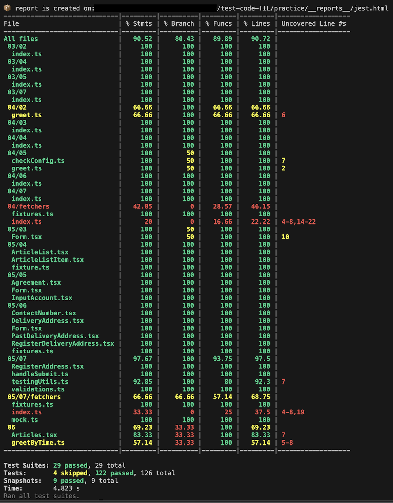
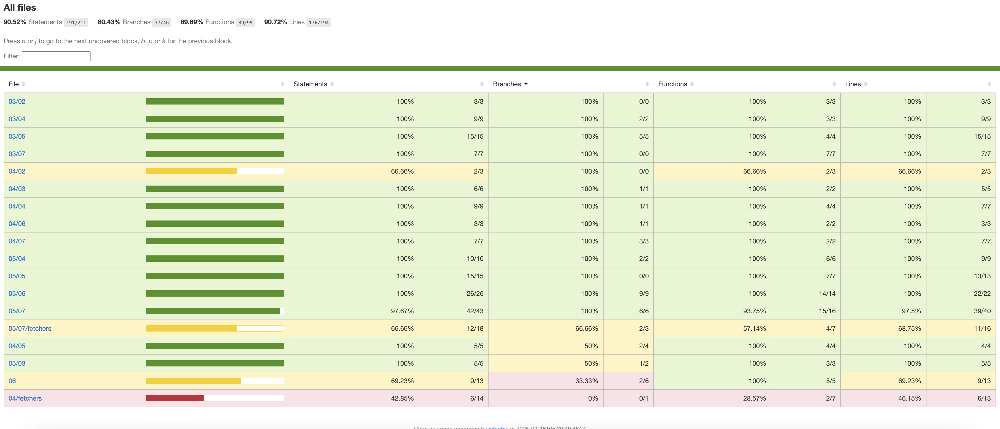
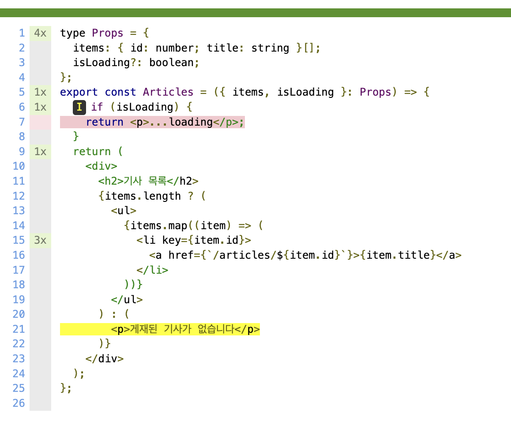

# Chapter 6 커버리지 리포트 읽기

<br/><br/>

## 1. 커버리지란?

```
테스트 커버리지란 시스템 및 소프트웨어에 대해 충분히 테스트가 되었는지를 나타내는 정도이다. 수행한 테스트가 얼마나 테스트 대상을 커버했는지를 나타낸다. 코드 커버리지란 테스트에 의해 실행된 소스 코드의 양을 나타낸 것이다.
```

나른한 개발자 [[Testing] 코드 커버리지 (Code Coverage)](https://velog.io/@newdana01/Test-%ED%85%8C%EC%8A%A4%ED%8A%B8-%EC%BB%A4%EB%B2%84%EB%A6%AC%EC%A7%80-Test-Coverage) 에서

<br/><br/>

## 2. 커버리지 리포트 출력하기

제스트에도 커버리지 리포트 기능을 지원한다.

```
npx jest --coverage
```

명령어를 실행하면 다음과 같은 리포트 결과가 나온다.



<br/><br/>

jest 설정파일에 `collectCoverage`를 설정하면 웹에서 더 간편하고 보기좋게 확인할 수 있다.

```typescript
// /jest.config.ts
export default {
  collectCoverage: true,
  coverageDirectory: 'coverage',
};
```



<br/><br/>

## 3 커버리지 리포트 구성

| File   | Stmts         | Branch        | Funcs         | Lines         | Uncovered Line     |
| ------ | ------------- | ------------- | ------------- | ------------- | ------------------ |
| 파일명 | 구문 커버리지 | 분기 커버리지 | 함수 커버리지 | 라인 커버리지 | 커버되지 않은 라인 |

<br/>

- Stsms (구문 커버리지)

구현 파일에 있는 모든 구문이 적어도 한 번은 실행됐는지 나타낸다.

<br/>

- Branch (분기 커버리지)

구현 파일에 있는 ㅁ모든 조건 분기가 적어도 한 번은 실행됐는지 나타낸다. if문, case 문, 삼항연산자를 사용한 분기문이 측정 대상이다.

<br/>

- Funcs (함수 커버리지)

구현 파일에 있는 모든 함수가 적어도 한 번은 호출됐는지 나타낸다. 이 지표를 통해 프로젝트에서 실제로 사용하지 않지만 export된 함수를 찾을 수 있다.

<br/>

- Lines (라인 커버리지)

구현 파일에 포함된 모든 라인이 적어도 한 번은 통과됐는지 나타낸다.

<br/><br/>

## 4. 함수의 테스트 커버리지

```typescript
// 테스트할 코드
export function greetByTime() {
  const hour = new Date().getHours();
  if (hour < 12) {
    return '좋은 아침입니다';
  } else if (hour < 18) {
    return '식사는 하셨나요';
  }
  return '좋은 밤 되세요';
}

// 테스트 코드
describe('greetByTime(', () => {
  beforeEach(() => {
    jest.useFakeTimers();
  });
  afterEach(() => {
    jest.useRealTimers();
  });
  // (1) '좋은 아침입니다'를 반환하는 함수
  xtest("아침에는 '좋은 아침입니다'를 반환한다", () => {
    // xtest를 사용해 테스트 시 특정 테스트를 생략할 수 있다.
    jest.setSystemTime(new Date(2023, 4, 23, 8, 0, 0));
    expect(greetByTime()).toBe('좋은 아침입니다');
  });
  // (2) '식사는 하셨나요'를 반환하는 함수
  xtest("점심에는 '식사는 하셨나요'를 반환한다", () => {
    jest.setSystemTime(new Date(2023, 4, 23, 14, 0, 0));
    expect(greetByTime()).toBe('식사는 하셨나요');
  });
  // (3) '좋은 밤되세요'를 반환하는 함수
  xtest("저녁에는 '좋은 밤 되세요'를 반환한다", () => {
    jest.setSystemTime(new Date(2023, 4, 23, 21, 0, 0));
    expect(greetByTime()).toBe('좋은 밤 되세요');
  });
});
```

### 1,2,3 생략 시


<br/>

### 2,3 생략시


<br/>

### 3 생략시


<br/>

### 생략하지 않음


<br/>

이처럼 구현된 함수의 내부를 한 라인씩 검사하면서 테스트에서의 실행 여부를 확인할 수 있다.
이렇게 생성된 커버리지 리포트는 구현 코드의 내부 구조를 파악하여 논리적으로 문서를 작성하는 테스트 방법인 `화이트박스 테스트`에 필수다

<br/><br/>

## 5. UI 컴포넌트의 테스트 커버리지

```typescript
// 테스트할 코드
export const Articles = ({ items, isLoading }: Props) => {
  if (isLoading) {
    return <p>...loading</p>;
  }
  return (
    <div>
      <h2>기사 목록</h2>
      {items.length ? (
        <ul>
          {items.map((item) => (
            <li key={item.id}>
              <a href={`/articles/${item.id}`}>{item.title}</a>
            </li>
          ))}
        </ul>
      ) : (
        <p>게재된 기사가 없습니다</p>
      )}
    </div>
  );
};

// 테스트 코드
test('목록에 표시할 데이터가 있으면 목록이 표시된다', () => {
  const items = [
    { id: 1, title: 'Testing Next.js' },
    { id: 2, title: 'Storybook play function' },
    { id: 3, title: 'Visual Regression Testing ' },
  ];
  render(<Articles items={items} isLoading={false} />);
  expect(screen.getByRole('list')).toBeInTheDocument();
});
```

이 함수의 커버리지는 아래의 사진처럼 7번째 줄 로딩 분기의 라인이 강조되는 것을 볼 수 있다.
이를 보면 `목록에 표시할 데이터가 없는 상태`의 테스트가 부족하다는 것을 알 수 있어야 한다.



```typescript
test("데이터를 불러오는 중이면 '..loading'을 표시한다", () => {
  render(<Articles items={[]} isLoading={true} />);
  expect(screen.getByText('...loading')).toBeInTheDocument();
});

test("목록이 비어 있으면 '게재된 기사가 없습니다'를 표시한다", () => {
  render(<Articles items={[]} isLoading={false} />);
  expect(screen.getByText('게재된 기사가 없습니다')).toBeInTheDocument();
});
```

`목록에 표시할 데이터가 없는 상태`의 테스트를 추가하면 강조된 라인이 사라지는 것을 볼 수 있다.


이처럼 테스트 커버리지는 측정이 가능한 정량 지표다. 이를 이용하여 `분기 커버리지가 80% 이상이 아니면 CI를 통과하지 못한다`등의 배포 파이프라인을 작성할 수도 있다. 하지만 여기서 알아야할 점은 커버리지 수치가 높다고 해서 소프트웨어 품질이 높거나 버그가 없다는 것은 아니다.
커버리지 충족은 작성된 테스트가 통과했다는 것이며, 커버리지가 충족하지 않다면 테스트가 부족하다는 의미 정도를 가질 수 있다.

<br/><br/>

## 6. 커스텀 리포터

테스트 실행 결과는 여러 리포터를 통해 더 자세하게 확인할 수 있다. jest에는 대표적으로 `jest-html-reporters`가 있다.

```typescript
export default {
  reporters: [
    'default',
    [
      'jest-html-reporters',
      {
        publicPath: '__reports__',
        filename: 'jest.html',
      },
    ],
  ],
};
```


```typescript
// (1) '좋은 아침입니다'를 반환하는 함수
test("아침에는 '좋은 아침입니다'를 반환한다", () => {
  jest.setSystemTime(new Date(2023, 4, 23, 18, 0, 0)); // 시간을 8에서 18로 변경
  expect(greetByTime()).toBe('좋은 아침입니다');
});
```

실패한 테스트에 대해서는 목록의 `[info]` 버튼이 생긴다. 이 버튼을 누르면 테스트에 대한 실패 상세 정보가 나온다.


다양한 report는 [여기서](https://github.com/jest-community/awesome-jest/blob/main/README.md#reporters) 확인할 수 있다.
