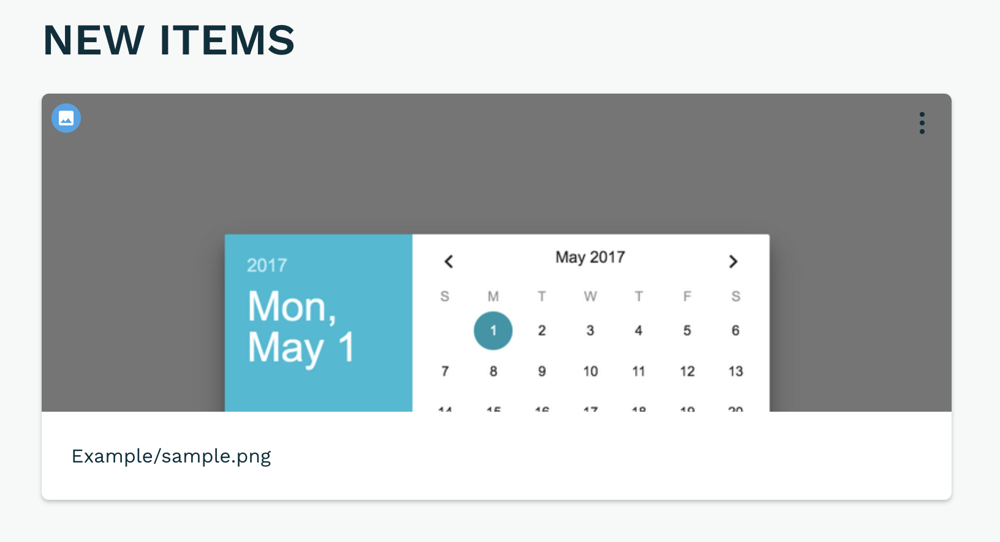
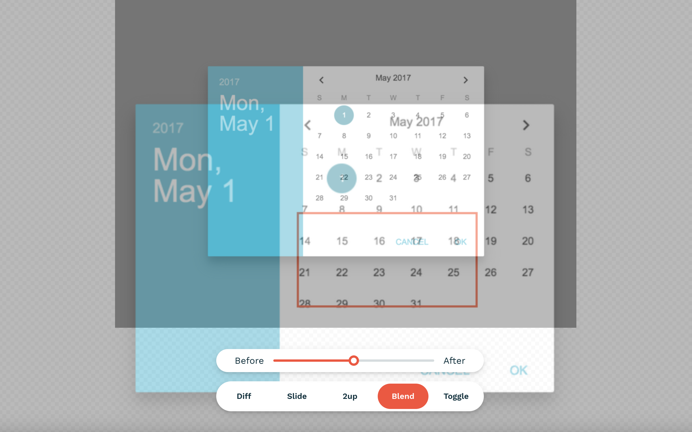
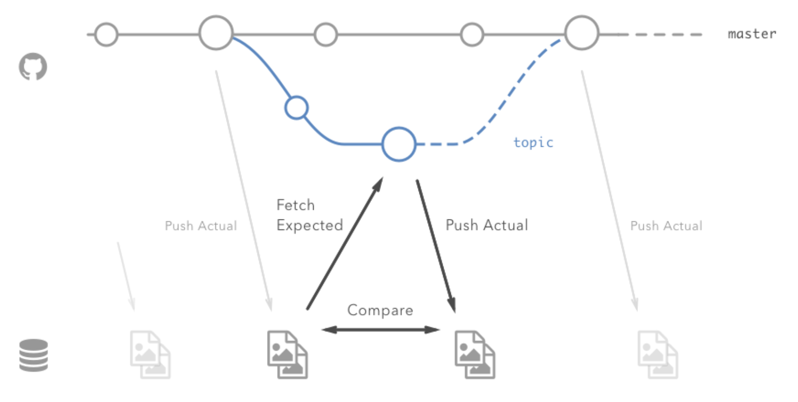
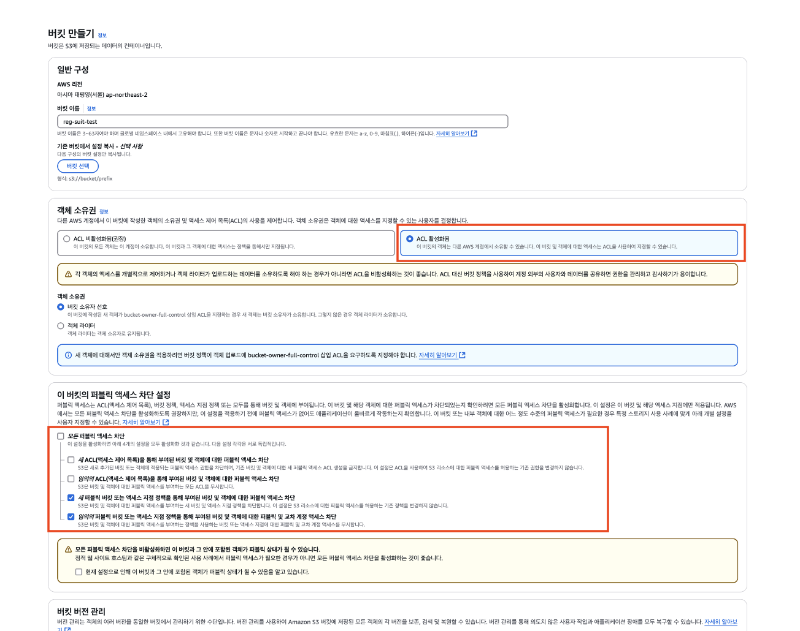

# Chapter 9 시각적 회귀 테스트

<br/><br/>

## 1. 시각적 회귀 테스트의 필요성

### 1 - 1 스타일 변경 검증의 어려움

CSS는 여러 프로퍼티에 의해 결정된다. 한 컴포넌트 안에 적용된 CSS 프로퍼티는 다양한 파일에 들어있는 CSS 코드에 의해 적용되며 적용된 순서에 따라서도 실제 브라우저에서 보여지는 스타일은 달라진다. 그러므로 시각적 회귀 테스트를 하는 가장 이상적인 방법은 브라우저별로 모든 페이지를 육안으로 확인해보는 것인데, 이는 너무 비효율적이며 불가능하다.

<br/>

### 1 - 2 스냅숏 테스트는 시각적 회귀 테스트를 대체할 수 없다.

스냅숏 테스트는 클래스 속성의 변경으로 스타일이 변경되는 것을 감지할 수 있지만 전역에 정의된 스타일이나 그 컴포넌틀르 감싸는 Wrapper 컴포넌트에서 적용한 스타일까지는 알 수 없다. 즉 단위 테스트에서는 알아차리지 못했던 문제를 통합 테스트에서 발견하는 상황과 비슷하다.

<br/>

### 1 - 3 시각적 회귀 테스트의 선택지

시각적 회귀 테스트는 크로미엄 같은 브라우저를 헤드리스 모드로 실행한 상태에서 실시한다. 일반적으로 헤드리스 브라우저는 E2E 테스트 프레임워크에 포함되었으며, 대부분 E2E 테스트 프레임워크에서 시각적 회귀 테스트를 지원한다. 프레임워크가 지원하는 시각적 회귀 테스트는 화면을 요청하고 화면이 이동하면 화면을 캡처한다. 이와 같은 방식으로 모든 페이지를 캡처하면 스타일 변경 전후의 차이점을 발견할 수 있다.

<br/><br/>

## 2. reg-cli로 이미지 비교하기

시각적 회귀 테스트 프레임워크 `reg-cli`를 사용해보자

```
npx reg-cli actual expected diff -R index.html
```

- actual: 기존 이미지를 저장하는 디렉터리
- expected: 비교할 이미지를 저장하는 디렉터리
- diff: 비교 결과를 검출한 이미지를 저장하는 디렉터리

actual에 다른 이미지 파일을 저장하고 위 명령어를 실행하면 `expected`에는 없는 이미지 하나를 발견했다는 리포트가 index.html에 출력된다.


<br/>

사진이 수정되었을 때에도 변경점을 볼 수 있다.

```
npx reg-cli actual expected diff -U // 이전 업데이트 내역 갱신
npx reg-cli actual expected diff -R index.html
```



<br/><br/>

## 3. 스토리캡 도입

스토리캡은 스토리북에 등록된 스토리를 캡처하는 도구다. 스토리캡은 reg-suit를 중심으로 한 reg-viz 생태계에 속하지만, reg-suit 플러그인과 달리 별도로 설치해야 한다.

```
yarn add storycap -D
```

<br/>

### 3 - 1 스토리캡 설정

```typescript
// .storybook/preview.js
import { withScreenshot } from 'storycap';
export const decorators = [withScreenshot];

// .storybook/main.js
module.exports = {
  addons: ['storycap'],
};
```

<br/>

### 3 - 2 스토리캡 실행

개발 서버에서도 스토리캡을 실행할 수 있지만 빌드를 한 후 실행해야 응답 속도가 빨라지기 때문에 사전에 빌드하는 것을 권장한다.

```json
{
  "scripts": {
    "storybook:build": "storybook build",
    "storycap": "storycap --serverCmd \"npx http-server storybook-static -a localhost -p 6006\" http://localhost:6006"
  }
}
```

<br/>

```
yarn storybook:build
yarn storybook
npm run storycap
```

빌드가 끝나고 `npm run storycap`을 실행하면 빌드된 스토리북을 정적 사이트로 실행해 모든 스토리를 캡처하여
`npx reg-cli`로 비교할 수 있다.

<br/><br/>

## 4. reg-suit 도입하기

reg-suit을 사용해 시각적 회귀 테스트를 로컬 환경이 아닌 원격 환경에서 진행해본다.<br/>
reg-suit 시스템 원리는 다음과 같다

<br/>

|             개발자              |           깃허브 액션            |                     AWS S3                      |
| :-----------------------------: | :------------------------------: | :---------------------------------------------: |
|                                 |         저장소에 푸시 ➡️         |                ➡️ 스토리북 빌드                 |
|                                 |                ⬇️                |
|                                 |          스토리북 캡쳐           |
|                                 |                ⬇️                |
|    비교할 이미지 가져오기 ⬅️    | ⬅️ 과거에 캡처한 스토리북 이미지 |
|                                 |                ⬇️                |
| 비교 결과가 담긴 리포트 받기 ⬅️ |          ⬅️ 이미지 비교          |
|                                 |                ⬇️                |
|                                 |   새로 캡처한 이미지 업로드 ➡️   | ➡️ 커밋 해시를 이름으로 새로 캡처한 이미지 저장 |

<br/><br/>

### 4 - 1 설치 방법

```
npx reg-suit init
```

이 명령어를 사용하면 어떤 플러그인을 설치할지 물어볼 것인데, 이 때 기본적으로 선택되어 있는 세 가지 플러그인을 선택한다.

```
❯◉  reg-keygen-git-hash-plugin : Detect the snapshot key to be compare with using Git hash.
 ◉  reg-notify-github-plugin : Notify reg-suit result to GitHub repository
 ◉  reg-publish-s3-plugin : Fetch and publish snapshot images to AWS S3.
 ◯  reg-notify-chatwork-plugin : Notify reg-suit result to Chatwork channel.
 ◯  reg-notify-github-with-api-plugin : Notify reg-suit result to GHE repository using API
 ◯  reg-notify-gitlab-plugin : Notify reg-suit result to GitLab repository
 ◯  reg-notify-slack-plugin : Notify reg-suit result to Slack channel.
```



`reg-keygen-git-hash-plugin`, `reg-notify-github-plugin`, `reg-publish-s3-plugin`은
CI 환경에서 `reg-suit`를 도입시켜주는 편리하게 해주며, 원격 환경에서 이미지를 비교하기 위한 라이브러리다.
커밋 해시로 파일명을 지은 스냅숏셋과 검증 결과 리포트를 외부 파일 찾아서 서비스(ASW S3)에 전송한다. 깃허브에 연동된 저장소 브랜치를
토픽 브랜치라고 하는데 이 토픽 브랜치의 기반이 되는 커밋에서 나온 스냅숏셋을 기반으로 기대값으로 두어 이후의 커밋에서 추출한 이미지와 비교하여 차이점을 검출하는 방식이다.

여기서 다운받지 않은 플러그인들 중에는 검증 결과를 풀 리퀘스트에 알려주는 `reg-notify-github-plugin`을 사용할 수도 있고,깃랩, 슬랙에 알림을 주는 플러그인도 있다.

```json
// regconfig.json
{
  "core": {
    "workingDir": ".reg",
    "actualDir": "directory_contains_actual_images",
    "thresholdRate": 50, // 0 -> 50으로 수정(차이점으로 검출된 부분을 허용하는 임계치)
    "ximgdiff": {
      "invocationType": "client"
    }
  },
  "plugins": {
    "reg-keygen-git-hash-plugin": true,
    "reg-notify-github-plugin": {
      "prComment": true,
      "prCommentBehavior": "default",
      "clientId": "$REG_NOTIFY_CLIENT_ID" // 추가
    },
    "reg-publish-s3-plugin": {
      "bucketName": "$AWS_BUCKET_NAME" // 추가
    }
  }
}
```

<br/><br/>

## 5 AWS S3 설정



## 6 github-action 설정

```yaml
name: Run VRT

on: push

env:
  REG_NOTIFY_CLIENT_ID: ${{ secrets.REG_NOTIFY_CLIENT_ID }}
  AWS_BUCKET_NAME: ${{ secrets.AWS_BUCKET_NAME }}

jobs:
  build:
    runs-on: ubuntu-latest

    steps:
      - uses: actions/checkout@v3
        with:
          fetch-depth: 0
      - uses: actions/setup-node@v2
        with:
          node-version: 18
      - name: Configure AWS Credentials
        uses: aws-actions/configure-aws-credentials@master
        with:
          aws-access-key-id: ${{ secrets.AWS_ACCESS_KEY_ID }}
          aws-secret-access-key: ${{ secrets.AWS_SECRET_ACCESS_KEY }}
          aws-region: ap-northeast-2
      - name: Install dependencies
        run: yarn install
      - name: Build Storybook
        run: yarn build:storybook
      - name: Run Storycap
        run: yarn storycap
      - name: Run reg-suit
        run: yarn vrt:run
```
